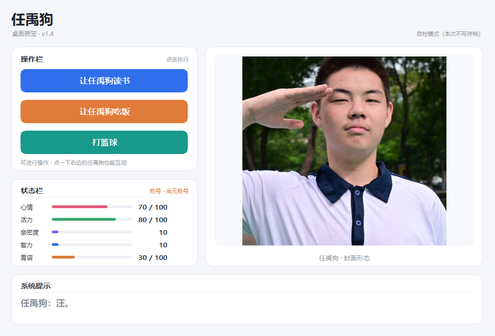
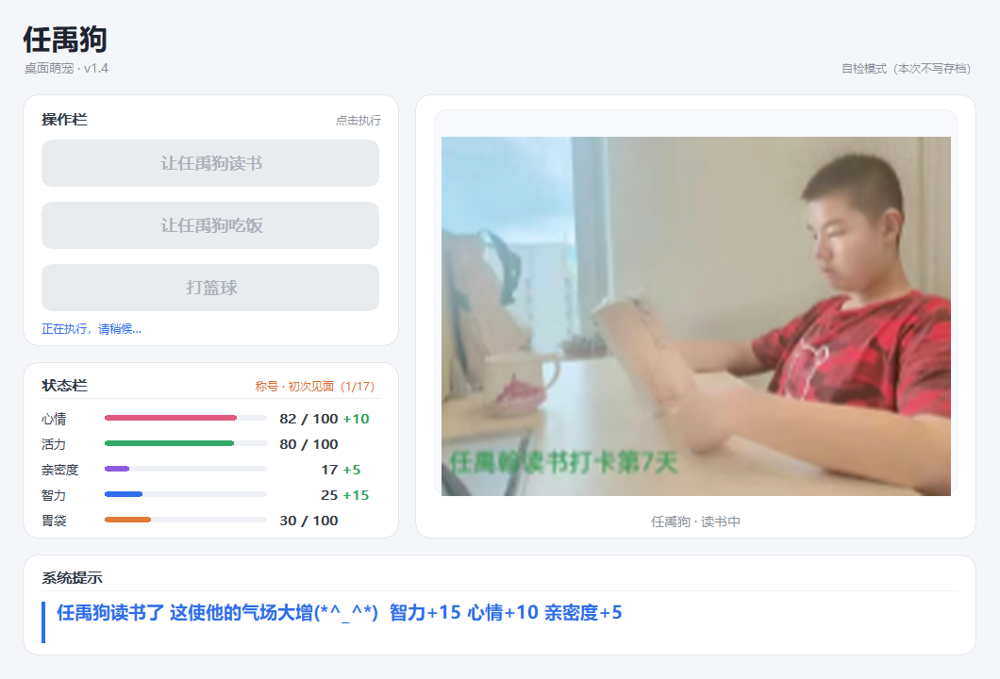
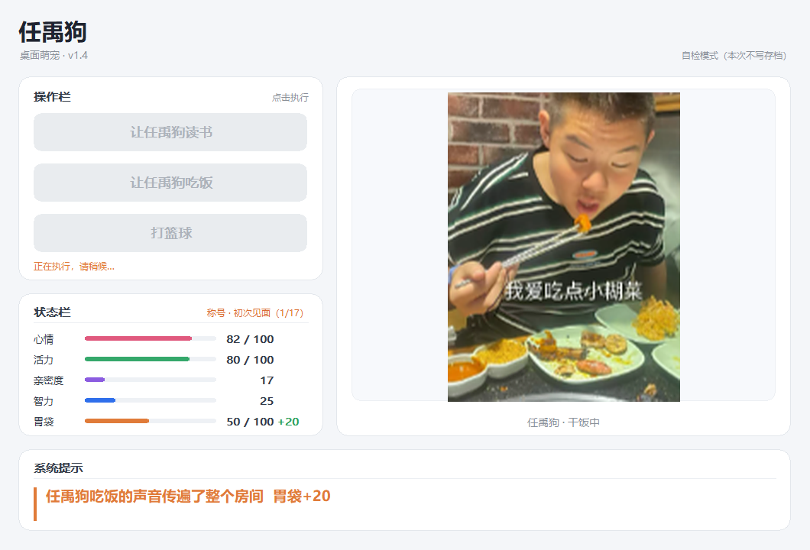
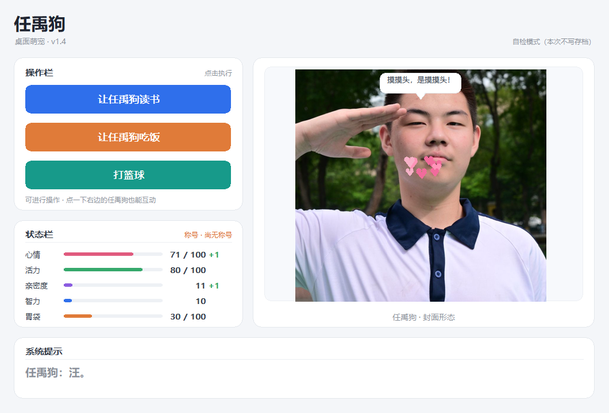

# 任禹狗

一只住在桌面上的狗。点它读书、吃饭、打篮球，它会顶嘴、会发光、会跟你要亲密度。



Windows 单文件绿色程序，**不依赖 tkinter / Qt / 任何 GUI 框架**——整个界面（卡片、按钮、状态条、
提示栏、立绘）都是 ctypes 直接调 Win32 GDI API 一笔一笔画出来的，资源全部 base64 内嵌，
所以只有一个 17 MB 的 exe，双击就跑，不留安装痕迹。

## 怎么玩

| 操作 | 效果 |
| --- | --- |
| 让任禹狗读书 | 智力 +15、心情 +10、亲密度 +5 |
| 让任禹狗吃饭 | 胃袋 +20；**打球冷却期间吃饭会立刻解除冷却** |
| 打篮球 | 随机三种结局：摔倒 / 开心 / 发怒，各自结算不同数值；打完冷却 1 分钟 |
| 点立绘（摸摸头） | 心情、亲密度各 +1；连点会挨骂 |

互动期间按钮变灰、不可重复点击，立绘以「压缩 → 升起 → 停留 → 复位」的方式切换。




## 状态系统

心情 / 活力 / 亲密度 / 智力 / 胃袋 五项。前三项上限 100，**智力与亲密度不设上限**，
下限统一为 0。数值变化时该行右侧会浮出 `±N`（升绿降红），1.8 秒后消失。

## 趣味功能

**摸摸头**：鼠标移到立绘上，它会凑近一点并冒出一句气泡；点下去会左右抖动、冒出一蓬爱心，
再随机吐槽一句。短时间内连点 3 次以上会切换成「撸秃了」专属台词。600 ms 节流，
所以狂点刷不了数值。



**随机台词库**：每个动作有 3~7 句台词随机抽取，且**绝不连续重复**——最多只会看到相邻两句不一样，
但同一次互动从收起到升起只说一句（这点是刻意的，不然提示栏会闪着连换两句）。
空闲时会随心情 / 胃袋 / 活力告急主动提醒。

**称号**：17 个称号按累计次数和数值解锁，从「初次见面」到「一生挚友」。解锁瞬间提示栏会发贺电，
当前称号显示在状态栏右上角和标题栏。

**本地存档**：写在 `%LOCALAPPDATA%\任禹狗\`，`save.json` 给程序读，`行动记录.txt` 给人看。
每次互动结算后立刻落盘，中途崩溃也不丢。打球冷却是按墙上时钟存的，关掉程序再打开会继续倒计时。
连按两次 <kbd>F2</kbd> 可以清空存档。

## 运行

**直接用 exe**（推荐）：下载 `dist/任禹狗.exe` 双击即可。

**从源码跑**：

```bash
pip install pillow
python src/app.py
```

需要 Python 3.13（3.10+ 应该也行）。

## 重新打包

```bash
python tools/build_assets.py   # 素材 -> src/assets.py（base64 内嵌）
python tools/build_exe.py      # src/app.py -> dist/任禹狗.exe
```

`src/assets.py` 是**自动生成**的，不要手改。素材来源与结构见下文。

## 目录结构

```
├── src/
│   ├── app.py            唯一主程序：布局常量、颜色表、台词库、称号表、自绘逻辑全在这里
│   └── assets.py         自动生成：立绘 / 音效 / 图标的 base64 内嵌
├── tools/
│   ├── build_assets.py   素材 -> assets.py
│   ├── build_exe.py      唯一的重新出包入口
│   ├── verify_snapshots.py   自检截图做像素 + 日志断言
│   ├── cut_audio.py / verify_audio.py / analyze_audio.py   音效裁剪与校验
│   ├── subtitle_timeline.py  从二创视频字幕里定位歌词时间轴，确定裁剪点
│   ├── test_persist.py       存档端到端
│   ├── e2e_save_check.py     真机跑 exe：启动 -> 点击 -> 关闭 -> 查存档
│   └── cleanup.py / probe_python_env.py / check_*.py / inspect_assets.py
├── media/
│   ├── pet/*.png         七个立绘（长边已限到 800）
│   └── 欸？大狗！[BV1xyJA6BEBN].*    音效来源（原曲 / 二创视频）
├── docs/                 README 用的界面截图
└── dist/任禹狗.exe        打包产物
```

## 自检

这个程序没有 GUI 测试框架，只有一套「截图 + 像素断言」的自检——因为窗口是自绘的，
所以**画出来的每个像素本身就是可断言的**。

```bash
python src/app.py --selftest                    # 纯逻辑，44 项，不开窗
python src/app.py --snapshot build/snap         # 跑完整流程并截图（约 50 秒）
python tools/verify_snapshots.py build/snap     # 对截图做像素 + 日志断言
python tools/test_persist.py                    # 存档端到端，30 项
python tools/e2e_save_check.py                  # 真机跑 exe，18 项
```

自检模式下冷却被缩短到 8 秒（否则跑不完「冷却到期」用例），并且**不碰真实存档**。
截图时间表必须按真实动画时长排（收起 180 ms / 升起 260 ms / 读书整套 3880 ms / 篮球整套 5320 ms），
每张截图都要躲开上一批粒子特效，否则立绘比对会被气泡或爱心污染。

## 素材来源

- **音效**：裁自 B 站二创视频 [《欸？大狗！》BV1xyJA6BEBN](https://www.bilibili.com/video/BV1xyJA6BEBN)。
  这首歌里并没有逐字的「大狗大狗」，程序里「打篮球」用的其实是「（看）大狗叫叫」。
  裁剪点见 `tools/cut_audio.py` 的 `CLIPS`，整套时间轴由 `tools/subtitle_timeline.py` 从视频字幕定位。
- **立绘**：来自网络素材，仅供学习交流，版权归原作者所有。如有侵权请联系删除。

代码本身欢迎随意取用。
